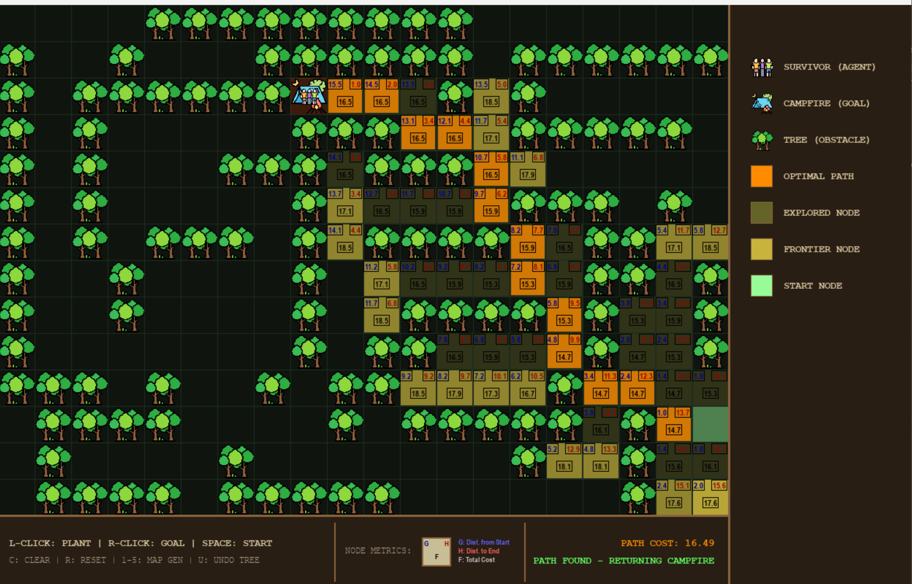
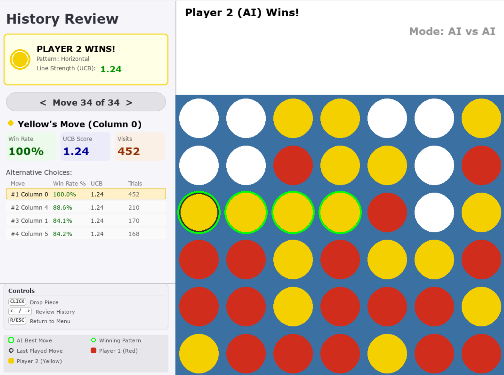

# A-Pathfinding-CarloConnect-MCTS

## 📝 Overview
This repository contains the implementation of two distinct Artificial Intelligence systems developed for game scenarios:
1.  **Part 1: A* (A-Star) Pathfinding** applied to a grid-based survivor simulation with physics-based steering behaviors.
2.  **Part 2: Monte Carlo Tree Search (MCTS)** applied to a Connect 4 agent with heuristic rollouts and UCB optimization.

Built using **Python** and **Pygame**.

## 🌲 Part 1: A* Pathfinding (The Survivor)
A simulation where an agent (The Survivor) must navigate through a dark forest to reach a target (The Campfire). The system visualizes the internal logic of the A* algorithm in real-time.

### Key Features
* **Algorithm:** A* Search using **Octile Distance** heuristic (optimized for 8-direction movement).
* **Real-time Visualization:** * **Frontier Nodes:** Candidates for exploration (Yellow halo).
    * **Explored Nodes:** Closed set nodes (Dim light).
    * **Cost Metrics:** Displays **G** (Distance from start), **H** (Heuristic to goal), and **F** (Total cost) on every node.
* **Physics-Based Movement:** * Unlike standard grid-snapping, the agent uses **Steering Behaviors** (Seek & Arrive).
    * Calculates velocity and acceleration for smooth movement along the generated path waypoints.
* **Map System:** Includes 5 preset complex maps and supports dynamic obstacle placement.



### Usage & Controls
Run the pathfinding simulation:
```bash
cd .\A-PATHFINDING-CARLOCONNENT\src\Part1-PathFinding
python main.py
```

| Key / Action | Function |
|-------------|-----------|
| Left Click | Place Obstacle (Tree) |
| Right Click | Place Goal (Campfire) |
| Space | Start Pathfinding |
| 1 - 5 | Load Preset Maps (Sherwood, Black Forest, etc.)|
| C | Clear Map (Remove all walls and paths) |
| R | Reset Path  (Keep walls, clear search data)" |
| U | Undo/Remove Obstacle under cursor |
| Q | Quit |

## 🔴 Part 2: MCTS (Connect 4)
A Connect 4 implementation featuring an AI agent capable of probabilistic decision-making using Monte Carlo Tree Search. The UI includes a detailed analytics dashboard to "peek" into the AI's brain.

### Key Features
* **Algorithm:** MCTS with the standard 4 phases: Selection, Expansion, Simulation, Backpropagation.
* **Decision Logic:** Uses Upper Confidence Bound (UCB) to balance Exploration vs. Exploitation.
* **Smart Simulation:** Implements a heuristic rollout policy (checks for immediate wins/blocks) rather than purely random play to reduce noise.
* **Analytics Dashboard:** 
    * Live Win Rate Distribution chart.
    * Move rankings based on visit counts and UCB scores.
    * **History Review System:** Step back through the game to analyze what the AI was thinking at any specific turn.



### Usage & Controls
Run the pathfinding simulation:
```bash
cd .\A-PATHFINDING-CARLOCONNENT\src\Part2-MCTS
python main.py
```
**Game Modes**
1. Human vs Human
2. Human vs AI (Recommended for demo)
3. AI vs AI

| Key / Action | Function |
|-------------|-----------|
| Mouse Click | Drop piece in column |
| Right Click | Confirm AI Move (When AI is "Waiting for Confirmation") |
| Space | Confirm AI Move (When AI is "Waiting for Confirmation") |
| Left/Right Arrow | Review Game History (After Game Over)|
| R | Return to Main Menu |
| Q | Quit |

## ⚙️ Technical Implementation Details
### Heuristic Choice (Part 1)
I selected the **Octile Distance** heuristic: `D * (dx + dy) + (D2 - 2 * D) * min(dx, dy)`

- *Why?* The survivor moves in 8 directions. Manhattan distance overestimates diagonal costs, while Euclidean distance is computationally heavier and can underestimate grid costs. Octile provides the mathematically correct estimate for an 8-way grid.

### MCTS Optimization (Part 2)
To solve the "Randomness Issue" inherent in standard MCTS:

- I implemented a **Heuristic Rollout**: During the simulation phase, the agent explicitly checks if a move leads to an immediate win or if it needs to block an opponent's win.

- This stabilizes the backpropagated values, ensuring strong moves are identified significantly faster than with random simulations.

## 📂 Project Structure
### Part 1 Files `Part1-PathFinding`
`main.py`: Entry point for the Pathfinding simulation.

`pathfinding.py`: Implementation of A* algorithm and Octile heuristic.

`entities.py`: Survivor class implementing Physics/Steering behaviors.

`maps.py`: 2D array data for the 5 map presets.

`nodes.py`: Node class structure (costs, parents, coordinates).

`draw.py`: Rendering logic for the grid and UI.

`controls.py`: Input handling.

`settings.py`: Configuration constants (Colors, Screen Size).

`utils.py`: Helper functions for math and cost drawing.

### Part 2 Files `Prt2-MCTS`
`connect4_mcts.py`: Standalone file containing the Game Engine, MCTS Logic (MCTSNode, rollout), and UI Rendering.

## 📦 Installation
Ensure you have Python installed. This project requires pygame.

1. Clone the repository.
```bash
git clone https://github.com/ThangHoang54/A-Pathfinding-CarloConnect.git
```
2. Install dependencies:

```bash
pip install pygame
```
Run the desired part using the commands listed in the usage sections above.

## 🛠️ Tech Tool

- **Python**: The core programming language used for all game logic and AI. 💻
- **Pygame**: A cross-platform set of Python modules used for handling the game loop, rendering 2D graphics, and processing user input. 🎮

## 📜 License

Distributed under the MIT License. See LICENSE for more information.

## 🎓 Acknowledgement

This project is an assignment 2 for the **COSC3145: Games and Artificial Intelligence Techniques** course in semester _2025C_ at **RMIT University** 🏛️. The starter project, core concepts, and assignment specification were provided by the course staff


